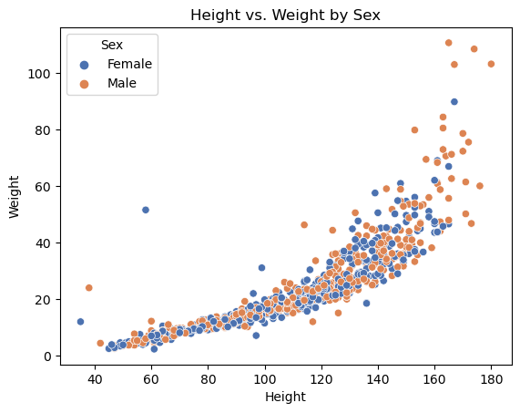
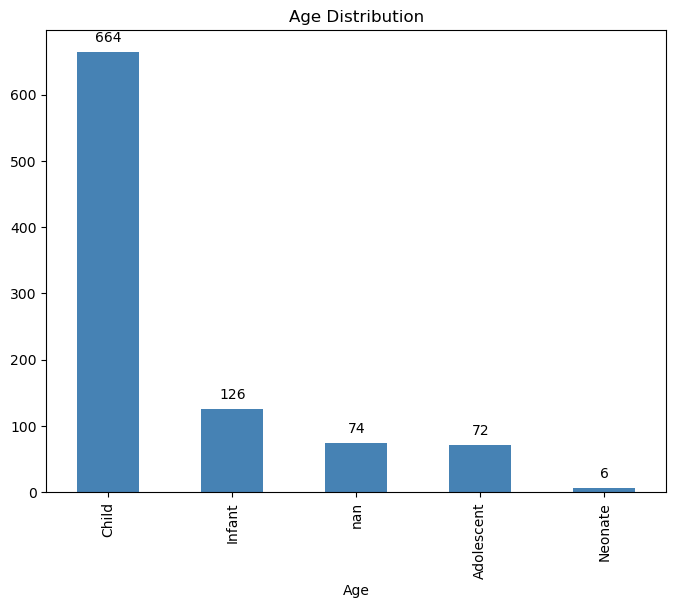
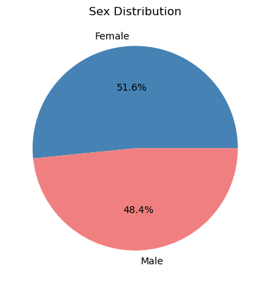
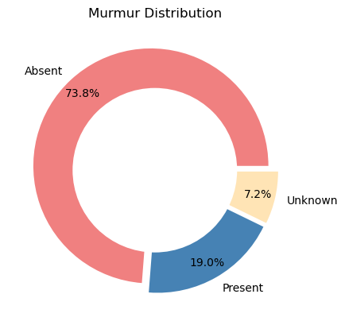
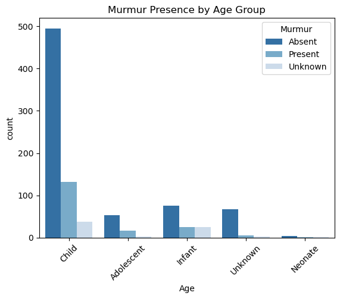
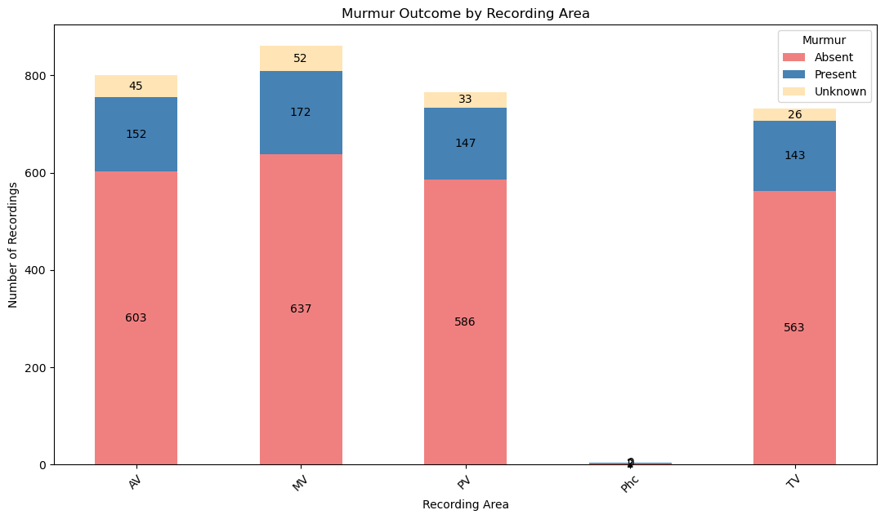
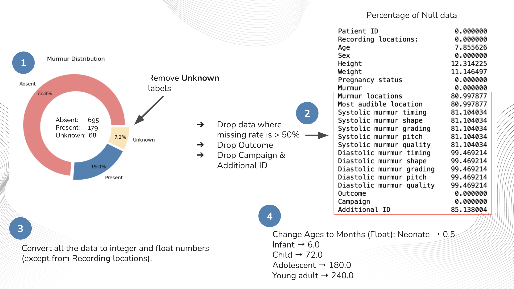
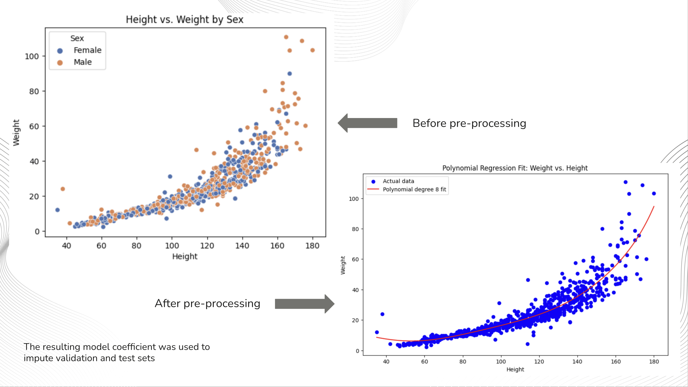
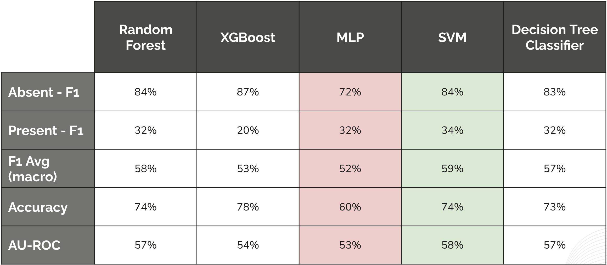
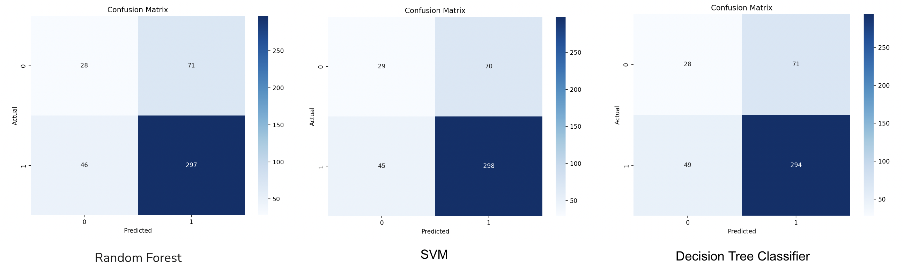

This project was an attempt of the Heart Murmur Detection from Phonocardiogram Recordings: The George B. Moody PhysioNet Challenge 2022.

# Dataset exploration and Analysis

The dataset was explored and various charts and figures were plotted in Matplotlib and Seaborn to understand the data better. The dataset was also cleaned and preprocessed to remove any missing values and outliers. The dataset was then split into training, validation, and test sets for training and evaluation of the machine learning models.







## Murmur Details







## Processing Pipeline



### Age Imputation with KNN

Age was imputed using the KNN algorithm. The KNN algorithm was used to find the nearest neighbors of the missing age value and then the missing age value was imputed with the average of the nearest neighbors.

### Height Imputation with Polynimial Regression



# Results



## Confusion Matrices

0 = Murmur, 1 = No Murmur



# Prerequisites & Setup

`new_team_code.py` works on the train, validation, and test .csv and audio files and due to their size, we had to upload the audio files to Google Drive.

Before running the code, the datasets need to be downloaded. Due to licensing restrictions, I had to remove the download links.

- test set: https://drive.google.com/file/d/**************************************/view?usp=sharing
- validation set: https://drive.google.com/file/d/**************************************/view?usp=sharing
- Training set: https://drive.google.com/file/d/**************************************/view?usp=sharing

And extract them into their respective folders the dataset folder. Below is the code structure for the `new_team_code.py` files for reference:

```python
csv_file_path = "dataset/training_data.csv"
training_data_recording = "dataset/train_data"
val_file_path = "dataset/val_data.csv"
validation_data_recording = "dataset/validation_data"
test_file_path = "dataset/test_data.csv"
testing_data_recording = "dataset/test_data"
```

# Running the code

Run the coding with the following commands:

Random Forest model:

    python3 new_team_code.py 1 or python3 new_team_code.py

XGBoost model:

    python3 new_team_code.py 2

MLP model:

    python3 new_team_code.py 3

SVM model:

    python3 new_team_code.py 4

Decision Tree Classifier:

    python3 new_team_code.py 5

The algorithm predicts the presence or absence of murmurs in a set of patients. It first ingests data from the training, validation, and test datasets provided by PhysioNet. The algorithm performs all necessary imputations on the training data, while filling any missing values in the validation and test data with 0.0. Next, it extracts features from the corresponding recordings and combines these features with others (such as age and sex). Finally, the algorithm trains the machine learning model using the training dataset and evaluates it using the test dataset.
